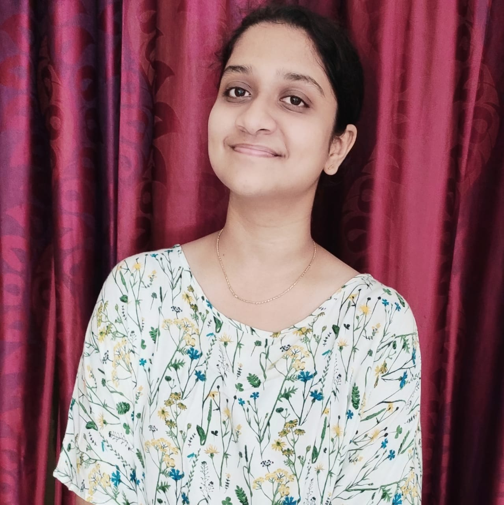

<!DOCTYPE html>
<html lang="en">

<head>
  <!-- meta -->
  <meta charset="utf-8">
  <meta content="width=device-width, initial-scale=1.0" name="viewport">

  <title>Kolli Sudeepa</title>
  <meta content="" name="keywords">
  <meta content="" name="description">

  <!-- Google Fonts -->
  <link href="https://fonts.googleapis.com/css?family=Poppins:300,300i,400,400i,500,500i,600,600i,700,700i|Playfair+Display:400,400i,700,700i,900,900i" rel="stylesheet">
  <link href="https://fonts.googleapis.com/css2?family=Dancing+Script:wght@700&display=swap" rel="stylesheet">

  <!-- Bootstrap CSS File -->
  <link href="lib/bootstrap/css/bootstrap.min.css" rel="stylesheet">

  <!-- Libraries CSS Files -->
  <link href="lib/ionicons/css/ionicons.min.css" rel="stylesheet">
  <link href="lib/owlcarousel/assets/owl.carousel.min.css" rel="stylesheet">
  <link href="lib/magnific-popup/magnific-popup.css" rel="stylesheet">
  <link href="lib/hover/hover.min.css" rel="stylesheet">

  <!-- Main Stylesheet File -->
  <link href="css/style.css" rel="stylesheet">

  <!-- Responsive css -->
  <link href="css/responsive.css" rel="stylesheet">

  <!-- Favicon -->
  <link rel="shortcut icon" href="images/favicon.png">

  </head>
<!DOCTYPE html>
<html lang="en">

<head>
  <!-- meta -->
  <meta charset="utf-8">
  <meta content="width=device-width, initial-scale=1.0" name="viewport">

  <title>Kolli Sudeepa</title>
  <meta content="" name="keywords">
  <meta content="" name="description">

  <!-- Google Fonts -->
  <link href="https://fonts.googleapis.com/css?family=Poppins:300,300i,400,400i,500,500i,600,600i,700,700i|Playfair+Display:400,400i,700,700i,900,900i" rel="stylesheet">
  <link href="https://fonts.googleapis.com/css2?family=Dancing+Script:wght@700&display=swap" rel="stylesheet">

  <!-- Bootstrap CSS File -->
  <link href="lib/bootstrap/css/bootstrap.min.css" rel="stylesheet">

  <!-- Libraries CSS Files -->
  <link href="lib/ionicons/css/ionicons.min.css" rel="stylesheet">
  <link href="lib/owlcarousel/assets/owl.carousel.min.css" rel="stylesheet">
  <link href="lib/magnific-popup/magnific-popup.css" rel="stylesheet">
  <link href="lib/hover/hover.min.css" rel="stylesheet">

  <!-- Main Stylesheet File -->
  <link href="css/style.css" rel="stylesheet">

  <!-- Responsive css -->
  <link href="css/responsive.css" rel="stylesheet">

  <!-- Favicon -->
  <link rel="shortcut icon" href="images/favicon.png">

  </head>
<!DOCTYPE html>
<html lang="en">

<head>
  <!-- meta -->
  <meta charset="utf-8">
  <meta content="width=device-width, initial-scale=1.0" name="viewport">

  <title>Kolli Sudeepa</title>
  <meta content="" name="keywords">
  <meta content="" name="description">

  <!-- Google Fonts -->
  <link href="https://fonts.googleapis.com/css?family=Poppins:300,300i,400,400i,500,500i,600,600i,700,700i|Playfair+Display:400,400i,700,700i,900,900i" rel="stylesheet">
  <link href="https://fonts.googleapis.com/css2?family=Dancing+Script:wght@700&display=swap" rel="stylesheet">

  <!-- Bootstrap CSS File -->
  <link href="lib/bootstrap/css/bootstrap.min.css" rel="stylesheet">

  <!-- Libraries CSS Files -->
  <link href="lib/ionicons/css/ionicons.min.css" rel="stylesheet">
  <link href="lib/owlcarousel/assets/owl.carousel.min.css" rel="stylesheet">
  <link href="lib/magnific-popup/magnific-popup.css" rel="stylesheet">
  <link href="lib/hover/hover.min.css" rel="stylesheet">

  <!-- Main Stylesheet File -->
  <link href="css/style.css" rel="stylesheet">

  <!-- Responsive css -->
  <link href="css/responsive.css" rel="stylesheet">

  <!-- Favicon -->
  <link rel="shortcut icon" href="images/favicon.png">

  </head>

<body>

    

      

        

          

            

              
            

          

        

        

          

            
<h3>Who am I?   </h3>

            
I'm <b>Kolli Sudeepa</b>. I'm currently pursuing my BTech in the Computer Science department at Vignan's Institute of Information Technology. I believe that <b>Knowledge is power</b>. And in this way, I love to learn the breakthrough in technology and prepare myself professionally. People often call me <b>noble</b>, as it best describes me. I mostly involve in establishing effective relationships and gain technical insights. I am also inclined towards creative activities such as poetry, music, debate, etc.

          

        

      

    

  

    

      

        <ul class="list-unstyled">
          <li><a href="https://www.linkedin.com/in/sudeepanoble/"><i class="ion-social-linkedin"></i></a></li>
          <li><a href="https://github.com/SudeepaNoble"><i class="ion-social-github"></i></a></li>
          <li><a href="https://twitter.com/i_sudeepa"><i class="ion-social-twitter"></i></a></li>
          <li><a href="https://www.instagram.com/i_noble.sudeepa/"><i class="ion-social-instagram"></i></a></li>
          <li><a href="https://www.facebook.com/sudeepa.kolli"><i class="ion-social-facebook"></i></a></li>
        </ul>

      

    

  

